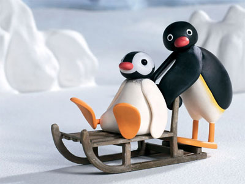

# ImageWorkshop

## Quickstart

You don't want to spend time to read all the documentation of ImageWorkshop (you'll read it later if you have special needs...), ok, so let's see a quick overview of ImageWorkshop that will teach you the basics of the class !

First, [install ImageWorkshop](installation.md) in your project, and then lets play with the class !

### Initialize a layer

A layer will contains the image you want to work with. Here we initialize a layer from a physical image on the server:

```php
$pinguLayer = ImageWorkshop::initFromPath(__DIR__.'/../path/to/images/pingu.jpg');
```

The layer will have the width and the height of this image. At every moment, you can get the width and the height (in pixel) of a layer thanks to these methods:

```php
echo $pinguLayer->getWidth();
echo $pinguLayer->getHeight();
```

In our example, we suppose that Pingu picture dimensions are 640px for 480px in our example:


You can see all the methods to initialize a layer (from an upload form, a PHP var...) at the [initialization chapter](documentation.md#2-initialization-of-a-layer).

### Apply an action

Then, you are able to apply an action, like a resize, on this layer:

```php
$pinguLayer->resizeInPixel(400, null, true);
```

Here I choose to resize the layer to have a width of 400px, and also to auto-resize the height to conserve proportions.

There are many actions (rotate, crop...), learn them at the [actions chapter](documentation.md#4-actions-on-layers).

Here what the layer seems after the resize:



### Superimposition

ImageWorkshop allows you to **superimpose plural layers** on the top of each other: every layer has a **stack of sublayers** on its top, empty by default.

We want to add 2 images on the top of our pingu, to start we initialize 2 other layers:

```php
$wwfLogoLayer = ImageWorkshop::initFromPath(__DIR__.'/../path/to/images/wwf.png');
$tuxLayer = ImageWorkshop::initFromPath(__DIR__.'/../path/to/images/tux.png');
```

Then we add them on the stack of the pingu layer (understand on the top of this layer):

```php
$pinguLayer->addLayerOnTop($wwfLogoLayer, 20, 10, 'LB');
$pinguLayer->addLayerOnTop($tuxLayer, 20, 10, 'RT');
```

You can place the layers at the position you want on pingu layer:
* `$wwfLogoLayer` is placed at the left bottom position on the top of pingu layer thanks to the 4rth parameter, with the string value '**LB**' to say "**Left Bottom**". Also, it has a translation of **20px from the left** and **10px from the bottom** of pingu layer !
* `$tuxLayer` is placed at the **Right Top** ('**RT**') position on the pingu layer, with a translation of **20px from the right** and **10px from the top**.

You can see all the possible positions to place layers thanks to the [Corners / positions schema of an image](documentation/corners-schema-image.md).

And you can also learn more [about superimposition](documentation.md#1-layer-notion), which is very similar with Photoshop principle !

Here what the layer seems after we added the 2 logo layers in its stack:


### Managing the result

Finally, we choose to save our modified layer (in a folder):

```php
// Saving the result
$dirPath = __DIR__."/../web/uploads/2012";
$filename = "pingu_edited.png";
$createFolders = true;
$backgroundColor = null; // transparent, only for PNG (otherwise it will be white if set null)
$imageQuality = 95; // useless for GIF, usefull for PNG and JPEG (0 to 100%)

$pinguLayer->save($dirPath, $filename, $createFolders, $backgroundColor, $imageQuality);
```

We choose to save the image as a PNG, even the original was a JPEG, by specifying the extension in the filename.

If the folders don't exist, not a problem: by setting the third parameter true, ImageWorkshop will create them for you !

Of course, you can also show the result in the navigator, or get the image variable to work without ImageWorkshop, see here to [manage the result](documentation.md#3-manage-the-result).

### All the code of the quickstart tutorial

Here the final code of our guided tour in one small snippet:

```php
// Initialization of layers you need
$pinguLayer = ImageWorkshop::initFromPath(__DIR__.'/../path/to/images/pingu.jpg');
$wwfLogoLayer = ImageWorkshop::initFromPath(__DIR__.'/../path/to/images/wwf.png')
$tuxLayer = ImageWorkshop::initFromPath(__DIR__.'/../path/to/images/tux.png');

// resize pingu layer
$pinguLayer->resizeInPixel(400, null, true);

// Add 2 layers on pingu layer
$pinguLayer->addLayerOnTop($wwfLogoLayer, 20, 10, 'LB');
$pinguLayer->addLayerOnTop($tuxLayer, 20, 10, 'RT');

// Saving the result in a folder
$pinguLayer->save(__DIR__."/../web/uploads/2012", "pingu_edited.png", true, null, 95);
```

ImageWorkshop is really intuitive and simple to use, despite its high flexibility !

To finish, I invite you to read an important chapter of good pratices to [avoid some bugs](documentation.md#5-good-practices).

Now, you are able to play with the class !
